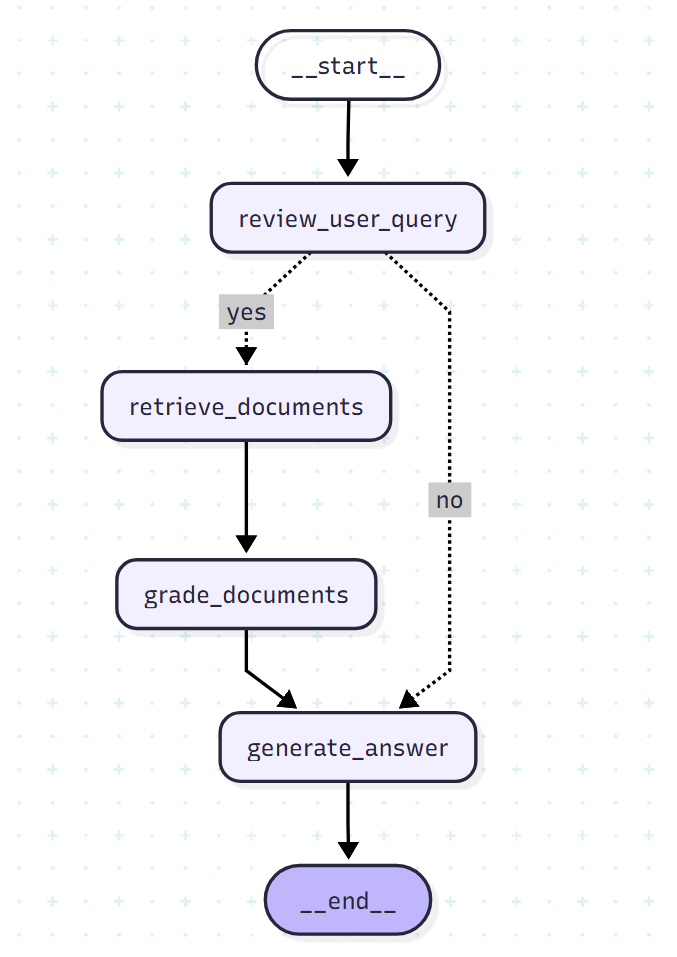

# BookRAG: Intelligent Document Q&A System

BookRAG is a sophisticated Retrieval-Augmented Generation (RAG) application that transforms your PDF book collection into an intelligent, conversational knowledge base. Built with Flask, LangGraph, LangChain, ChromaDB, and OpenAI, BookRAG enables users to ask natural language questions about their document collection and receive accurate, context-aware answers.

## 🎯 Overview

BookRAG processes your PDF documents (such as technical books, manuals, research papers, or any text-based content) and creates a searchable vector database. When you ask a question, the system intelligently retrieves relevant passages from your documents and generates comprehensive answers using advanced language models.

### Key Features

- **Intelligent Document Processing**: Automatically loads, cleans, and chunks PDF documents for optimal retrieval
- **Advanced Vector Search**: Uses Maximal Marginal Relevance (MMR) for diverse and relevant document retrieval
- **Smart Query Routing**: Determines whether document retrieval is needed or if the question can be answered directly
- **Document Grading**: Evaluates retrieved documents for relevance and quality before generating answers
- **Conversational Interface**: Modern, responsive web UI for seamless interaction
- **Chat History**: Persists conversation history for context-aware follow-up questions
- **Production-Ready Architecture**: Clean separation of concerns with scalable design patterns

## 📚 Supported Document Types

BookRAG is designed to work with technical and educational PDF documents. The system has been tested with collections including:

- **Linux & System Administration**: Kernel programming, systemd management, security hardening, networking
- **Programming Languages**: Python, JavaScript, TypeScript, PHP, Ruby, C++, and more
- **Machine Learning & AI**: Deep learning, neural networks, reinforcement learning, NLP, computer vision
- **Cloud & DevOps**: AWS, Azure, containerization, CI/CD, infrastructure automation
- **Cybersecurity**: Penetration testing, digital forensics, secure software design, ethical hacking
- **Data Science**: Statistics, data visualization, pandas, scientific computing, analytics
- **Web Development**: React, Django, REST APIs, front-end architecture, modern frameworks
- **Software Engineering**: Clean code, design patterns, architecture, testing methodologies

The system processes documents ranging from pocket references (1-5MB) to comprehensive textbooks (50-160MB), handling collections of 100+ books efficiently.

## 🏗️ Architecture

BookRAG follows a modular, layered architecture that separates concerns and enables easy maintenance and extension.

### System Flow



The application uses LangGraph to orchestrate a sophisticated RAG pipeline:

1. **Query Review**: Determines if document retrieval is necessary for the question
2. **Document Retrieval**: Searches the vector database using MMR for relevant passages
3. **Document Grading**: Evaluates retrieved documents for relevance and quality
4. **Answer Generation**: Synthesizes information from graded documents to produce comprehensive answers

### Project Structure

```
BookRAG/
├── app/                    # Flask web application
│   ├── routes.py          # API endpoints and route handlers
│   ├── config.py          # Configuration management
│   ├── templates/         # Jinja2 HTML templates
│   └── static/            # CSS and JavaScript assets
├── database/              # Data persistence layer
│   ├── connection.py      # SQLAlchemy database connection
│   ├── vector_store.py    # ChromaDB vector database wrapper
│   ├── document_loader.py # PDF loading and preprocessing
│   └── process_documents.py # Document ingestion pipeline
├── rag/                   # RAG pipeline implementation
│   ├── graph.py           # LangGraph workflow definition
│   ├── nodes.py           # Graph node functions
│   └── chains.py          # LangChain prompt chains
├── schema/                # Data models
│   ├── models.py          # Pydantic models for RAG state
│   └── users.py           # SQLAlchemy user models
├── prompts/               # LLM prompt templates
│   ├── retrieval_question.py
│   ├── grade_documents.py
│   └── generate_answer.py
├── utils/                 # Utility functions
│   └── crud.py            # Database CRUD operations
├── evaluation/            # RAGAS evaluation tools
│   └── evaluator.py       # RAG quality assessment
├── book_collection/       # Your PDF documents directory
├── db/                    # ChromaDB persistence directory
└── app.py                 # Application entry point
```

## 🚀 Quick Start

### Prerequisites

- Python 3.13 or higher
- [uv](https://github.com/astral-sh/uv) package manager (recommended) or pip
- OpenAI API key
- PDF documents in the `book_collection/` directory

### Installation

1. **Clone the repository** (or navigate to your project directory):
   ```bash
   cd BookRAG
   ```

2. **Install dependencies**:
   ```bash
   uv sync
   ```
   Or with pip:
   ```bash
   pip install -e .
   ```

3. **Set up environment variables**:
   Create a `.env` file in the project root:
   ```env
   # OpenAI Configuration
   OPENAI_API_KEY=your_openai_api_key_here
   OPENAI_EMBEDDING_MODEL=text-embedding-3-small
   
   # LLM Models (optional - defaults to gpt-4o if not specified)
   RETRIEVAL_REQUIRED_LLM=gpt-4o-mini
   DOCUMENT_GRADE_LLM=gpt-4o
   ANSWER_GENERATE_LLM=gpt-4o
   
   # Vector Store Configuration
   VECTOR_STORE_NAME=rag_database
   VECTOR_STORE_DB_PATH=db
   VECTOR_STORE_DOCUMENTS_DIRECTORY=book_collection
   
   # Flask Configuration
   FLASK_SECRET_KEY=your-secret-key-here
   DATABASE_URL=sqlite:///bookrag.db
   
   # Environment
   CURRENT_STATE=development
   ```

4. **Initialize the database**:
   ```bash
   uv run python -m database.create_user_db
   ```

5. **Process your documents**:
   Place your PDF files in the `book_collection/` directory, then run:
   ```bash
   uv run python -m database.process_documents
   ```
   
   This will:
   - Load all PDF files from `book_collection/`
   - Clean and preprocess text (removing artifacts, fixing encoding issues)
   - Split documents into optimal chunks (1000 characters with 200 character overlap)
   - Generate embeddings using OpenAI's embedding model
   - Store vectors in ChromaDB for fast retrieval
   
   **Note**: Processing a large collection (100+ books) may take 30-60 minutes depending on your hardware and API rate limits.

6. **Start the application**:
   ```bash
   uv run python app.py
   ```
   
   Or with Flask directly:
   ```bash
   uv run flask --app app run
   ```

7. **Access the web interface**:
   Open your browser and navigate to `http://localhost:5000`

## 💬 Usage

### Web Interface

The BookRAG web interface provides a clean, modern chat experience:

1. **Ask Questions**: Type your question in the input field and press Enter (or click Send)
2. **View Responses**: The AI will retrieve relevant information from your document collection and generate comprehensive answers
3. **Review History**: Previous conversations are automatically saved and displayed when you reload the page
4. **Follow-up Questions**: Ask follow-up questions that build on previous context

### Example Queries

Based on a technical book collection, you might ask:

- "How do I configure systemd services in Linux?"
- "What are the best practices for securing a Linux server?"
- "Explain the difference between supervised and unsupervised learning"
- "How do I implement a REST API in Python using Flask?"
- "What are the key concepts in neural network architecture?"
- "How do I perform penetration testing on a web application?"

### API Endpoints

The application exposes RESTful API endpoints:

- `GET /` - Serves the chat interface with conversation history
- `POST /chat` - Processes a chat query and returns an answer
  ```json
  {
    "query": "Your question here"
  }
  ```
  
  Response:
  ```json
  {
    "answer": "Generated answer based on retrieved documents"
  }
  ```

## 🔧 Configuration

### Vector Store Settings

The vector store uses **Maximal Marginal Relevance (MMR)** search by default, which balances:
- **Relevance**: Documents similar to your query
- **Diversity**: Documents covering different aspects of the topic

You can adjust MMR parameters in `database/vector_store.py`:
- `k`: Number of documents to return (default: 4)
- `fetch_k`: Number of documents to consider for MMR (default: 20)
- `lambda_mult`: Balance between relevance and diversity (0.0-1.0, default: 0.5)

### Document Processing

Document processing settings can be adjusted in `database/document_loader.py`:
- `chunk_size`: Size of text chunks in characters (default: 1000)
- `chunk_overlap`: Overlap between chunks in characters (default: 200)
- `separators`: Priority order for splitting text (default: paragraph → line → sentence → word)

### LLM Configuration

You can configure different models for different tasks:
- **Retrieval Decision**: Fast, lightweight model (e.g., `gpt-4o-mini`)
- **Document Grading**: Balanced model for evaluation (e.g., `gpt-4o`)
- **Answer Generation**: High-quality model for final answers (e.g., `gpt-4o`)

## 🧪 Evaluation

BookRAG includes RAGAS (Retrieval-Augmented Generation Assessment) integration for evaluating system performance:

- **Faithfulness**: Measures if answers are derived from retrieved context
- **Answer Relevancy**: Evaluates how well answers address the question
- **Context Precision**: Assesses ranking quality of retrieved documents
- **Context Recall**: Measures completeness of retrieved information (requires ground truth)

To run evaluations, use the `evaluation/evaluator.py` module with a test dataset.

## 🛠️ Development

### Running Tests

```bash
uv run pytest
```

### Code Structure

The codebase follows clean architecture principles:

- **Separation of Concerns**: Each module has a single, well-defined responsibility
- **Type Safety**: Extensive use of Pydantic models and type hints
- **Error Handling**: Graceful degradation and informative error messages
- **Extensibility**: Easy to add new document types, retrieval strategies, or LLM providers

### Adding New Features

1. **New Document Types**: Extend `database/document_loader.py` to support additional formats
2. **Custom Retrieval**: Modify `database/vector_store.py` to implement hybrid search (vector + BM25)
3. **Enhanced Prompts**: Update prompt templates in `prompts/` for better results
4. **New Graph Nodes**: Add nodes to `rag/nodes.py` and update `rag/graph.py`

## 📊 Performance Considerations

### Document Processing

- **Large Collections**: Processing 100+ books may take 30-60 minutes
- **API Costs**: Embedding generation incurs OpenAI API costs (~$0.13 per 1M tokens)
- **Storage**: Vector database size is approximately 10-20% of original PDF size

### Query Performance

- **Retrieval Time**: Typically 100-500ms depending on collection size
- **Answer Generation**: 2-10 seconds depending on model and query complexity
- **Concurrent Users**: Flask development server handles multiple users, but consider production WSGI server for scale

### Optimization Tips

- Use smaller embedding models for faster processing (`text-embedding-3-small`)
- Adjust chunk size based on document type (smaller for dense technical content, larger for narrative)
- Implement caching for frequently asked questions
- Use connection pooling for production database deployments

## 🔒 Security Considerations

- **API Keys**: Never commit `.env` files or API keys to version control
- **User Data**: Chat history is stored locally in SQLite (consider encryption for sensitive data)
- **Input Validation**: User queries are sanitized, but consider additional validation for production
- **Rate Limiting**: Implement rate limiting for API endpoints in production
- **Authentication**: Currently uses a default test user - implement proper authentication for production

## 📝 License

This project is provided as-is for educational and research purposes.


## 🙏 Acknowledgments

BookRAG is built using excellent open-source libraries:

- [LangChain](https://www.langchain.com/) - LLM application framework
- [LangGraph](https://github.com/langchain-ai/langgraph) - Workflow orchestration
- [ChromaDB](https://www.trychroma.com/) - Vector database
- [Flask](https://flask.palletsprojects.com/) - Web framework
- [RAGAS](https://docs.ragas.io/) - RAG evaluation framework
- [OpenAI](https://openai.com/) - Language models and embeddings

## 📧 Support

For issues, questions, or contributions, please open an issue in the project repository.

---

**Happy Querying!** 🚀

Transform your book collection into an intelligent knowledge assistant with BookRAG.

